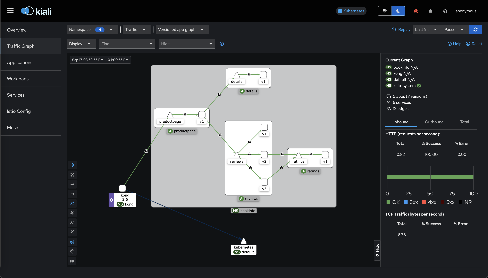

# Kong Istio example

This is a simple example on how to Use Istio With Kong Ingress Controller

## Install Istio

Install istio with minimal configuration profile.

```bash
istioctl install --set profile=minimal \
  --set meshConfig.accessLogFile=/dev/stdout \
  --skip-confirmation
```

## Install Monitoring tools

Install Istio monitoring tools

```bash
kubectl apply -f https://raw.githubusercontent.com/istio/istio/master/samples/addons/prometheus.yaml
kubectl apply -f https://raw.githubusercontent.com/istio/istio/master/samples/addons/kiali.yaml
kubectl apply -f https://raw.githubusercontent.com/istio/istio/master/samples/addons/jaeger.yaml
kubectl apply -f https://raw.githubusercontent.com/istio/istio/release-1.23/samples/addons/grafana.yaml

# Once the pods are ready
istioctl dashboard kiali

```

## Install bookinfo app

For this demo we will use istio’s bookinfo app.

```bash
# Create namespace bookinfo
kubectl create namespace bookinfo

# Add lable to namespace for auto sidecar injection.
kubectl label namespace bookinfo istio-injection=enabled

# Install bookinfo app
kubectl apply -f https://raw.githubusercontent.com/istio/istio/master/samples/bookinfo/platform/kube/bookinfo.yaml -n bookinfo

```

## Install Kong

Install Kong in namespace `kong` and auto inject istio sidecar proxy.

```bash
# Add kong helm chart repo
helm repo add kong https://charts.konghq.com

# Update repo
helm repo update

# Create Namespace Kong
kubectl create namespace kong

# Label namespace to allow istio sidecar injection
kubectl label namespace kong istio-injection=enabled

# Install Kong with helm
helm upgrade -i kong kong/kong -n kong
```

Once the Pod is running, we can save kong proxy ip to `KONG_PROXY_IP`

```bash
export KONG_PROXY_IP=$(kubectl -n kong get svc kong-kong-proxy -o=jsonpath='{.status.loadBalancer.ingress[0].ip}')
```

### Test Kong installation

```bash
curl $KONG_PROXY_IP

{
  "message":"no Route matched with those values",
  "request_id":"8f7d633006d3e263f3ac3b0644757d78"
}
```

## Create Ingress

Create an Ingress object to expose the bookinfo app via Kong

```bash
kubectl apply -f ./manifests/kong-istio-ingress.yaml -n bookinfo     
```

Check the bookinfo productpage

```bash
curl $KONG_PROXY_IP/productpage
```

## Enable mtls

Enable mTLS globally in the mesh

```bash
kubectl apply -f ./manifests/mesh-mtls.yaml -n istio-system
```

> Try `curl $KONG_PROXY_IP/productpage`. We will see an error like `upstream connect error or disconnect/reset before headers. reset reason: connection termination`. To resolve this, we need to annotate both the `productpage service` and our `ingress`.

```bash
# allow Kong to establish direct mTLS connections with the upstream pods.
kubectl -n bookinfo annotate service productpage ingress.kubernetes.io/service-upstream=true

# do NOT preserve request host header. The reason is that we want productpage to get the request directly from the sidecar.
kubectl -n bookinfo annotate ingress kong-istio-ingress konghq.com/preserve-host=false
```

Check kiali traffic graph to validate mTLS connections (Make sure display->security is checked)



# Split reviews traffic

Kong can distribute client requests across various backend services, but its capabilities are limited when those services aren't directly connected to it. For instance, in our demonstration, Kong doesn't control which `review` pod receives `requests` from the productpage. To achieve more precise request routing, we can utilize `VirtualService` and `DestinationRule` to manage traffic flow within the mesh.

```bash
kubectl apply -f ./manifests/split-reviews-traffic.yaml -n bookinfo
```

